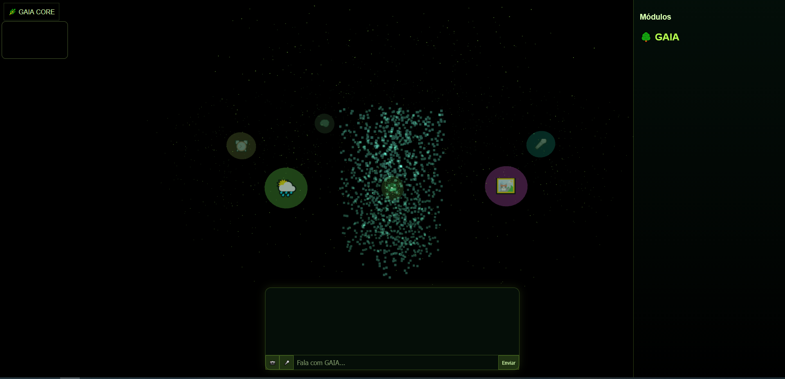
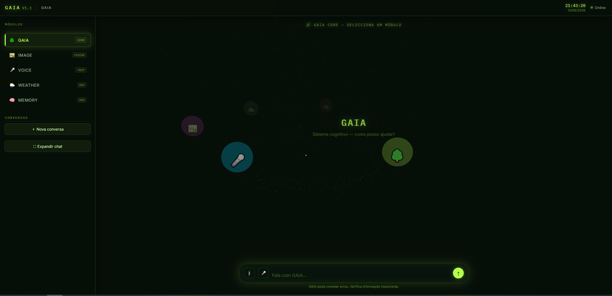
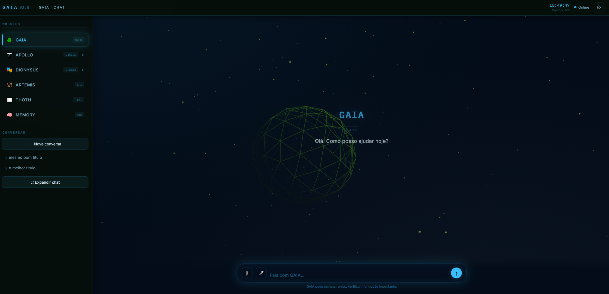

# GAIA 3.0 — Artificial Intelligence Framework

  <b>A modular Artificial Intelligence platform focused on conversation, memory, creativity and expansion.</b>

---

##  Preview: GAIA Evolution

The following images represent the evolution of GAIA throughout its development.

The first version started as a simple interface with the initial foundations of the system.

Over time, GAIA evolved into a more complex architecture, introducing additional modules, improved interaction, and a more structured environment.

The latest version was designed with integration in mind, preparing the system to connect all its components and enable a more complete AI framework.

GAIA version 2 was very similar to version 3 in terms of structure and design. However, it did not yet include the settings system for customization, which is why it was not included in this comparison.

---

##  Work in Progress (WIP)

GAIA 3.0 is currently under active development.

The frontend has already been developed, and the next phase is building the backend systems, AI integration and core architecture.

---

#  About GAIA

GAIA is a local-first Artificial Intelligence framework designed to evolve beyond a simple chatbot.

The goal is to create a modular AI environment capable of:

- intelligent conversations
- persistent memory
- specialized modules
- local AI models
- creative tools
- data analysis
- interactive systems

The project focuses on giving users control over their data, models and AI environment.

---

#  Features

## 💬 GAIA Chat

Main conversational system:

- Multiple conversations
- Persistent chat history
- Chat management
- Context handling
- Custom interaction profiles

---

##  Memory System

GAIA includes a memory layer designed for:

- storing information
- retrieving previous context
- organizing conversations
- semantic search integration

---

## 🧩 Modular Architecture

GAIA is built around independent modules.

### 🌿 GAIA

Core AI assistant and conversation engine.

---

### 🔮 THOTH

Analysis and intelligence tools.

---

### 🎭 DIONYSUS

Creative module:

- content creation
- documents
- code assistance
- generation tools

---

### 🚀 APOLLO

Visualization module:

- 3D viewer
- WebGL rendering
- Three.js integration

---

###  ARTEMIS

Experimental and auxiliary systems.

---

#  Technologies

## Backend

- Python
- Flask
- SQLite
- REST API

## Frontend

- HTML5
- CSS3
- JavaScript

## Visualization

- Three.js
- WebGL

---

# Project Structure
GAIA3.0/

 ├── config/

 │   └── system configuration

 │

 ├── db/

 │   └── database management

 │

 ├── gaia_core/

 │   └── artificial intelligence core

 │

 ├── languages/

 │   └── language support

 │

 ├── web/

 │   ├── templates/

 │   │   ├── HTML pages

 │   │   └── interface modules

 │   │

 │   └── static/

 │       ├── css/

 │       ├── js/

 │       └── images

 │

 └── run_gaia.py

